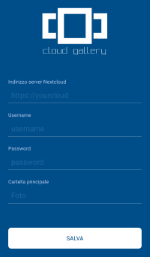
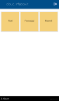
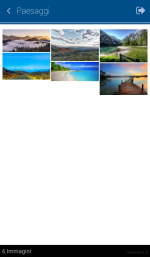
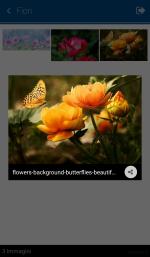
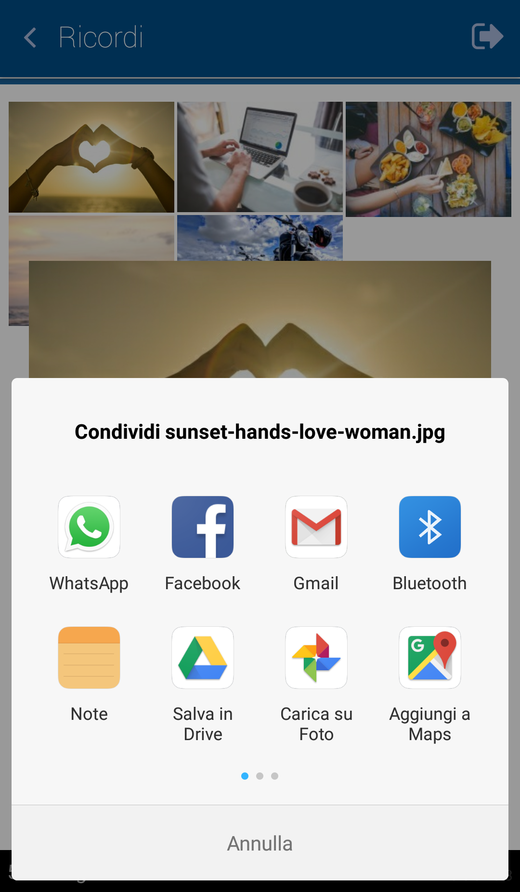

# Cloud Gallery
<p>Nativescript photo gallery app for Nextcloud.</p>
<p>Cloud Gallery is the app that allows you to scroll through and review all the photos stored on your Nextcloud account without having to download them first. You can review your favorite moments and share them quickly and easily, without taking up space on your smartphone.</p>

[](https://play.google.com/store/apps/details?id=it.linfaservice.cloudgallery)
      
<h2 id="screenshots">Screenshots</h2>









<h2 id="development">Development</h2>

This app is built with the NativeScript CLI. Once you have the [CLI installed](https://docs.nativescript.org/start/quick-setup), start by cloning the repo:

```
$ git clone https://github.com/linfaservice/cloudgallery.git
$ cd cloudgallery
```

From there you can use the `run` command to run Cloud Gallery:

```
$ tns run android
```
